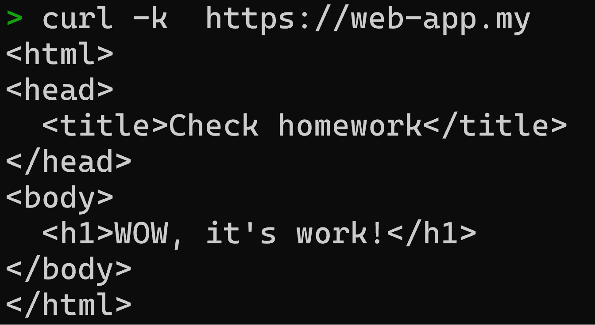

# Nginx Deployment with HTTPS on Kubernetes

## Задание 2: Создать приложение с вашей веб-страницей, доступной по HTTPS

Данное решение представляет собой пример развертывания Nginx на Kubernetes с использованием собственной веб-страницы. Веб-страница доступна по HTTPS.

## Deployment

### Nginx Deployment

[nginx-deployment.yaml](nginx-deployment.yaml)

### ConfigMap

[nginx-configmap.yaml](nginx-configmap.yaml)

### Network

[nginx-network.yaml](nginx-network.yaml)

### Secrets

Для создания секрета использовались следующие команды:

```bash
openssl req -x509 -newkey rsa:4096 -keyout key.pem -out cert.pem -days 365 -nodes -subj "/CN=my-nginx-app.com"
kubectl create secret tls nginx-tls-secret --key key.pem --cert cert.pem -n work-ns
```

## Демонстрация работы

### Скриншот доступа по HTTPS


